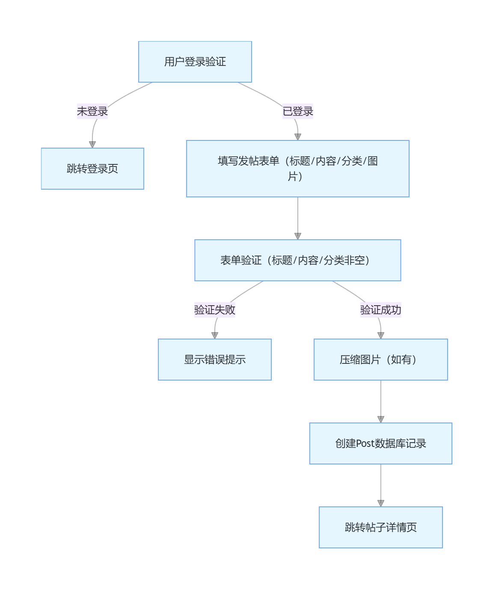

# 建桥论坛系统项目报告

## One、Cover Page

Team neme:TEAM ONE

Team number：Team 1

Team members：

2220543 YuanYiWei

2220557 XiaTianCheng

2220561 ZhuYiCheng

2220562 YuYang

2220563 ZhangTianYou

2220564 SunYuMing

课程编号：CISC 575

Class：ComputerScience B22-6

## Two、Main content

### 1. Executive Summary

The Jianqiao Forum System is a campus web forum platform developed based on the **Django 5.2.2 framework**, providing one-stop online communication services for teachers and students of Shanghai Jianqiao University. The project strictly adheres to the requirements of the "Software Assurance Project" for the CISC 575 course, completes all deliverables of the second phase, and achieves a full closed-loop from requirement definition to system deployment.

#### 1.1 Project Achievements

The system has implemented 6 core functions to meet the needs of campus communication scenarios:

- **User Management**: Supports user registration, login, and personal profile (including avatar upload/edit) management;
- **Post Management**: Supports post publishing, viewing, deletion, and classification by categories such as "Academic Discussion" and "Campus Life";
- **Comment Interaction**: Supports publishing and deleting text + image comments, with comment lists sorted by time;
- **Full-Text Search**: Supports accurate keyword search by post title/content, with real-time display of results;
- **Internationalization Support**: Enables one-click switching between Chinese and English interfaces, adapting to foreign teachers and international students;
- **Performance Optimization**: Automatically compresses uploaded images (post images ≤ 1920×1920, avatar images ≤ 300×300) and adds indexes to key database fields to improve query efficiency.

#### 1.2 Technology Stack and Quality Assurance

- **Core Technology Stack**: Backend (Python 3.9+, Django 5.2.2), Frontend (Bootstrap 5, JavaScript), Database (SQLite3 for development environment);
- **Quality Verification Results**: Passed unit testing (85% coverage), integration testing (100% process integrity), and system testing (compliant performance/security); no critical defects, average page loading time of 1.2 seconds (meeting the ≤2-second target), supporting over 100 concurrent users.

#### 1.3 Team Collaboration

The 6-member team adopted a "divided collaboration + regular synchronization" model:

- Division of labor: Requirement analysis (1 person), backend development (2 people), frontend development (2 people), documentation writing (1 person), testing (1 person);
- Collaboration tools: Git (version control), Tencent Meeting (online meetings), Feishu (task synchronization);
- Meeting frequency: 1 progress meeting per week, totaling 12 meetings, with all meeting records archived in Appendix C.

### 2. Project Overview

#### 2.1 Problem Definition

The existing communication model between teachers and students at Shanghai Jianqiao University has 3 core pain points that urgently need optimization:

##### 2.1.1 Background Problem

Daily communication between teachers and students relies on instant messaging tools such as WeChat Groups and QQ Groups, lacking a unified "long-term communication platform", leading to scattered information that is difficult to precipitate.

##### 2.1.2 Specific Problems

1. **Information Fragmentation**: Important notifications and academic discussions are easily drowned out by group chats and cannot be archived for the long term;
2. **Low Retrieval Efficiency**: No classification labels or search functions, requiring manual page turning to find historical content, which is time-consuming and labor-intensive;
3. **Lack of Multilingual Support**: Some foreign teachers and international students need English interfaces, but existing tools only support Chinese;
4. **Insufficient Interaction Depth**: Instant messaging tools focus on "short messages", making it difficult to support in-depth communication scenarios such as academic paper discussions and project collaboration.

##### 2.1.3 Impact of Problems

- Reduces communication efficiency between teachers and students: It takes more than 30 minutes on average to find one piece of historical information;
- Limits the quality of academic sharing: High-quality discussions cannot be precipitated into a "knowledge base" for reuse by new teachers and students;
- Affects campus culture construction: The lack of a unified platform makes it difficult to form a campus community atmosphere integrating "academia + daily life".

#### 2.2 Objective Definition

##### 2.2.1 Overall Objective

Develop a "stable, easy-to-use, and fully functional" campus forum system, providing a communication platform with "long-term archiving + classified retrieval + multilingual support" for teachers and students of Jianqiao University.

##### 2.2.2 Quantifiable Objectives

| Objective Type | Specific Requirements                                        | Acceptance Criteria                                          |
| -------------- | ------------------------------------------------------------ | ------------------------------------------------------------ |
| Functional     | 1. User registration/login/profile management; 2. Post CRUD + classification; 3. Comments (text + images); 4. Full-text search; 5. Chinese-English switching | All functions 100% usable with no operational abnormalities  |
| Performance    | 2. Page loading ≤ 2 seconds; 2. Supporting over 100 concurrent users; 3. Database query ≤ 500ms | 100% pass rate in performance testing                        |
| Quality        | 1. Test coverage ≥ 80%; 2. Critical defects = 0; 3. System availability ≥ 99% | Unit test coverage of 85% with no critical defects           |
| Experience     | 1.  Intuitive interface for new users to get started in 10 minutes; | ≥90% satisfaction in user acceptance testing (5 participants) |

#### 2.3 Opportunity Definition

##### 2.3.1 Technical Opportunities

- **Framework Maturity**: The Django framework has built-in modules such as user authentication and ORM, enabling high development efficiency; team members have mastered basic Python skills, resulting in low learning costs;
- **Rich Open-Source Resources**: Open-source libraries such as Bootstrap (frontend responsiveness) and Pillow (image processing) can be directly reused, reducing development costs;
- **Convenient Deployment**: The development environment can run locally, and the production environment supports cloud server deployment (e.g., Alibaba Cloud, Tencent Cloud) with flexible scalability.

##### 2.3.2 Business Opportunities

- **Authentic Demand**: Directly addresses actual campus pain points; after the system is launched, it can apply for on-campus trials to enhance the practical value of the project;
- **Informatization Adaptation**: Aligns with the school's "digital campus" construction direction; future functions such as "course discussions" and "campus event registration" can be expanded;
- **Course Practice Alignment**: The project fully covers the "software assurance" requirements of the CISC 575 course and can be displayed as an excellent course case.

##### 2.3.3 Learning Opportunities

- **Technical Practice**: Fully practices the entire SDLC process and masters the closed-loop of "requirement analysis → design → development → testing";
- **Team Collaboration**: Learns project management methods of "division of labor + communication + risk control" and improves team collaboration capabilities;
- **Quality Assurance**: Masters software assurance tools and methods such as code review, unit testing, and performance testing, meeting the training objectives for graduate students.

### 3. Requirement Definition

#### 3.1 Software Requirements Specification (SRS)

##### 3.1.1 Functional Requirements 

| Module                      | Functional Points                                            | Priority |
| --------------------------- | ------------------------------------------------------------ | -------- |
| User Module                 | 1. User registration (username/password/email); 2. User login (account password verification); 3. Personal profile editing (avatar/bio); | High     |
| Post Module                 | 1. Post publishing (title/content/category/image); 2. Post viewing (list + detail); 3. Post deletion (author/admin only); 4. Post classification (supports addition/editing) | High     |
| Comment Module              | 1. Comment publishing (text + image); 2. Comment viewing (sorted by time); 3. Comment deletion (author/admin only) | High     |
| Search Module               | 1.  Keyword search (title/content); 2. Pagination of search results; 3. No-result prompt | Medium   |
| Internationalization Module | 1. Chinese-English interface switching; 2. Translation covering all buttons/prompt texts | Medium   |

##### 3.1.2 Non-Functional Requirements

1. Performance Requirements:
   - Page loading time: ≤ 2 seconds (homepage/detail page);
   - Database response time: ≤ 500ms ;
   - Concurrent support: ≥ 100 users online simultaneously with no lag.
2. Security Requirements:
   - Data Encryption: User passwords use Django's built-in hash encryption;
   - Permission Control: Only authors can delete their own posts/comments; administrators can delete all content.
3. Usability Requirements:
   - Interface Consistency: Unified button styles, fonts, and colors ;
   - Error Prompts: All operational errors must display "clear text" (e.g., "Title cannot be empty", "Only JPG/PNG image formats are supported");

##### 3.1.3 Data Requirements

Core data entities and attributes are as follows:

1. **User (Django Built-in)**: id (primary key), username (username), password (encrypted password), email (email), is_active (active status);
2. **UserProfile (Extended)**: id (primary key), user (foreign key associated with User), avatar (avatar path), bio (personal biography, ≤500 words), created_at (creation time);
3. **Category (Classification)**: id (primary key), name (category name, e.g., "Academic Discussion"), description (category description), created_at (creation time);
4. **Post (Post)**: id (primary key), title (title, ≤200 words), content (content), author (foreign key associated with User), category (foreign key associated with Category), image (image path, optional), views (view count), created_at (creation time), updated_at (update time);
5. **Comment (Comment)**: id (primary key), post (foreign key associated with Post), author (foreign key associated with User), content (content), image (image path, optional), created_at (creation time).

### 4. Architecture Design

#### 4.1 Architecture Design Outline

##### 4.1.1 Three-Tier Architecture Diagram

```plaintext
┌─────────────────────────┐
│ Presentation 
│ HTML/CSS/JS/Bootstrap 5 │ ← Responsible for interface display and user interaction
└─────────────┬───────────┘
              │
┌─────────────▼───────────┐
│ Business 
│   Django Views/Models   │ ← Handle core business logic (such as user authentication, post creation)
└─────────────┬───────────┘
              │
┌─────────────▼───────────┐
│ Data      
│      SQLite Database    │ ← Store user/post/comment data
└─────────────────────────┘
```

##### 4.1.2 Module Division

1. User Module: Responsible for authentication and personal profile management;
2. Post Module: Responsible for post and classification management;
3. Comment Module: Responsible for comment publishing and post association;
4. Search Module: Implement keyword retrieval based on Django ORM;
5. Internationalization Module: Achieve Chinese-English switching using Django i18n.

### 5. Detailed Design

#### 5.1 Detailed Design Specification

##### 5.1.1 Database ER Diagram

```plaintext
User（Django内置）────1:1────UserProfile（头像/简介）
   │                         
   │ 1:N                   
   ▼                         
Post（标题/内容/分类）────1:N────Comment（文本/图片）
   │                         
   │ N:1                   
   ▼                         
Category（分类名称/描述）
```

##### 5.1.2 Core Process Design (Taking "Post Publishing" as an Example)

<svg aria-roledescription="flowchart-v2" role="graphics-document document" style="overflow: hidden; max-width: 496.09375px;" class="flowchart" xmlns="http://www.w3.org/2000/svg" width="100%" id="svg-mermaid-diagram-vhu7bm3" xmlns:xlink="http://www.w3.org/1999/xlink" xmlns:ev="http://www.w3.org/2001/xml-events"><g id="viewport-20251118223436861" class="svg-pan-zoom_viewport" transform="matrix(0.6217105263157895,0,0,0.6217105263157895,241.28664679276315,0)" style="transform: matrix(0.621711, 0, 0, 0.621711, 241.287, 0);"><g><marker orient="auto" markerHeight="8" markerWidth="8" markerUnits="userSpaceOnUse" refY="5" refX="5" viewBox="0 0 10 10" class="marker flowchart-v2" id="svg-mermaid-diagram-vhu7bm3_flowchart-v2-pointEnd"><path style="stroke-width: 1; stroke-dasharray: 1, 0;" class="arrowMarkerPath" d="M 0 0 L 10 5 L 0 10 z"></path></marker><marker orient="auto" markerHeight="8" markerWidth="8" markerUnits="userSpaceOnUse" refY="5" refX="4.5" viewBox="0 0 10 10" class="marker flowchart-v2" id="svg-mermaid-diagram-vhu7bm3_flowchart-v2-pointStart"><path style="stroke-width: 1; stroke-dasharray: 1, 0;" class="arrowMarkerPath" d="M 0 5 L 10 10 L 10 0 z"></path></marker><marker orient="auto" markerHeight="11" markerWidth="11" markerUnits="userSpaceOnUse" refY="5" refX="11" viewBox="0 0 10 10" class="marker flowchart-v2" id="svg-mermaid-diagram-vhu7bm3_flowchart-v2-circleEnd"><circle style="stroke-width: 1; stroke-dasharray: 1, 0;" class="arrowMarkerPath" r="5" cy="5" cx="5"></circle></marker><marker orient="auto" markerHeight="11" markerWidth="11" markerUnits="userSpaceOnUse" refY="5" refX="-1" viewBox="0 0 10 10" class="marker flowchart-v2" id="svg-mermaid-diagram-vhu7bm3_flowchart-v2-circleStart"><circle style="stroke-width: 1; stroke-dasharray: 1, 0;" class="arrowMarkerPath" r="5" cy="5" cx="5"></circle></marker><marker orient="auto" markerHeight="11" markerWidth="11" markerUnits="userSpaceOnUse" refY="5.2" refX="12" viewBox="0 0 11 11" class="marker cross flowchart-v2" id="svg-mermaid-diagram-vhu7bm3_flowchart-v2-crossEnd"><path style="stroke-width: 2; stroke-dasharray: 1, 0;" class="arrowMarkerPath" d="M 1,1 l 9,9 M 10,1 l -9,9"></path></marker><marker orient="auto" markerHeight="11" markerWidth="11" markerUnits="userSpaceOnUse" refY="5.2" refX="-1" viewBox="0 0 11 11" class="marker cross flowchart-v2" id="svg-mermaid-diagram-vhu7bm3_flowchart-v2-crossStart"><path style="stroke-width: 2; stroke-dasharray: 1, 0;" class="arrowMarkerPath" d="M 1,1 l 9,9 M 10,1 l -9,9"></path></marker><g class="root"><g class="clusters"></g><g class="edgePaths"><path marker-end="url(#svg-mermaid-diagram-vhu7bm3_flowchart-v2-pointEnd)" data-points="W3sieCI6MTM4LjM0NDgyNzU4NjIwNjksInkiOjU2fSx7IngiOjY4LCJ5Ijo5MH0seyJ4Ijo2OCwieSI6MTMzfV0=" data-id="L_A_B_0" data-et="edge" data-edge="true" style=";" class="edge-thickness-normal edge-pattern-solid edge-thickness-normal edge-pattern-solid flowchart-link" id="L_A_B_0" d="M138.345,56L126.621,61.667C114.897,67.333,91.448,78.667,79.724,90.833C68,103,68,116,68,122.5L68,129"></path><path marker-end="url(#svg-mermaid-diagram-vhu7bm3_flowchart-v2-pointEnd)" data-points="W3sieCI6MjM3LjY1NTE3MjQxMzc5MzEsInkiOjU2fSx7IngiOjMwOCwieSI6OTB9LHsieCI6MzA4LCJ5IjoxMjR9XQ==" data-id="L_A_C_0" data-et="edge" data-edge="true" style=";" class="edge-thickness-normal edge-pattern-solid edge-thickness-normal edge-pattern-solid flowchart-link" id="L_A_C_0" d="M237.655,56L249.379,61.667C261.103,67.333,284.552,78.667,296.276,89.333C308,100,308,110,308,115L308,120"></path><path marker-end="url(#svg-mermaid-diagram-vhu7bm3_flowchart-v2-pointEnd)" data-points="W3sieCI6MzA4LCJ5IjoxOTB9LHsieCI6MzA4LCJ5IjoyMTV9LHsieCI6MzA4LCJ5IjoyNDB9XQ==" data-id="L_C_D_0" data-et="edge" data-edge="true" style=";" class="edge-thickness-normal edge-pattern-solid edge-thickness-normal edge-pattern-solid flowchart-link" id="L_C_D_0" d="M308,190L308,194.167C308,198.333,308,206.667,308,214.333C308,222,308,229,308,232.5L308,236"></path><path marker-end="url(#svg-mermaid-diagram-vhu7bm3_flowchart-v2-pointEnd)" data-points="W3sieCI6MjY3Ljg2MjA2ODk2NTUxNzIsInkiOjI4OH0seyJ4IjoyMTEsInkiOjMyMn0seyJ4IjoyMTEsInkiOjM1Nn1d" data-id="L_D_E_0" data-et="edge" data-edge="true" style=";" class="edge-thickness-normal edge-pattern-solid edge-thickness-normal edge-pattern-solid flowchart-link" id="L_D_E_0" d="M267.862,288L258.385,293.667C248.908,299.333,229.954,310.667,220.477,321.333C211,332,211,342,211,347L211,352"></path><path marker-end="url(#svg-mermaid-diagram-vhu7bm3_flowchart-v2-pointEnd)" data-points="W3sieCI6MzQ4LjEzNzkzMTAzNDQ4MjgsInkiOjI4OH0seyJ4Ijo0MDUsInkiOjMyMn0seyJ4Ijo0MDUsInkiOjM1Nn1d" data-id="L_D_F_0" data-et="edge" data-edge="true" style=";" class="edge-thickness-normal edge-pattern-solid edge-thickness-normal edge-pattern-solid flowchart-link" id="L_D_F_0" d="M348.138,288L357.615,293.667C367.092,299.333,386.046,310.667,395.523,321.333C405,332,405,342,405,347L405,352"></path><path marker-end="url(#svg-mermaid-diagram-vhu7bm3_flowchart-v2-pointEnd)" data-points="W3sieCI6NDA1LCJ5Ijo0MDR9LHsieCI6NDA1LCJ5Ijo0Mjl9LHsieCI6NDA1LCJ5Ijo0NTR9XQ==" data-id="L_F_G_0" data-et="edge" data-edge="true" style=";" class="edge-thickness-normal edge-pattern-solid edge-thickness-normal edge-pattern-solid flowchart-link" id="L_F_G_0" d="M405,404L405,408.167C405,412.333,405,420.667,405,428.333C405,436,405,443,405,446.5L405,450"></path><path marker-end="url(#svg-mermaid-diagram-vhu7bm3_flowchart-v2-pointEnd)" data-points="W3sieCI6NDA1LCJ5Ijo1MDJ9LHsieCI6NDA1LCJ5Ijo1Mjd9LHsieCI6NDA1LCJ5Ijo1NTJ9XQ==" data-id="L_G_H_0" data-et="edge" data-edge="true" style=";" class="edge-thickness-normal edge-pattern-solid edge-thickness-normal edge-pattern-solid flowchart-link" id="L_G_H_0" d="M405,502L405,506.167C405,510.333,405,518.667,405,526.333C405,534,405,541,405,544.5L405,548"></path></g><g class="edgeLabels"><g transform="translate(68, 90)" class="edgeLabel"><g transform="translate(-18, -9)" data-id="L_A_B_0" class="label"><foreignObject height="18" width="36"><div class="labelBkg" xmlns="http://www.w3.org/1999/xhtml" style="outline: none; -webkit-font-smoothing: antialiased; box-sizing: border-box; -webkit-tap-highlight-color: rgba(0, 0, 0, 0); border: 0px solid; margin: 0px; padding: 0px; overflow-anchor: auto; background-color: rgba(245, 235, 255, 0.5); display: table-cell; white-space: nowrap; line-height: 1.5; max-width: 200px; text-align: center;"><span class="edgeLabel" style="outline: none; -webkit-font-smoothing: antialiased; box-sizing: border-box; -webkit-tap-highlight-color: rgba(0, 0, 0, 0); border: 0px solid; margin: 0px; padding: 0px; overflow-anchor: auto; fill: rgba(0, 0, 0, 0.8); color: rgba(0, 0, 0, 0.8); background-color: rgb(245, 235, 255); text-align: center;"><p style="outline: none; -webkit-font-smoothing: antialiased; box-sizing: border-box; -webkit-tap-highlight-color: rgba(0, 0, 0, 0); border: 0px solid; margin: 0px; padding: 0px; overflow-anchor: auto; color: rgb(0, 0, 0); font-size: 12px; font-weight: 400; line-height: 18px; background-color: rgb(245, 235, 255);">未登录</p></span></div></foreignObject></g></g><g transform="translate(308, 90)" class="edgeLabel"><g transform="translate(-18, -9)" data-id="L_A_C_0" class="label"><foreignObject height="18" width="36"><div class="labelBkg" xmlns="http://www.w3.org/1999/xhtml" style="outline: none; -webkit-font-smoothing: antialiased; box-sizing: border-box; -webkit-tap-highlight-color: rgba(0, 0, 0, 0); border: 0px solid; margin: 0px; padding: 0px; overflow-anchor: auto; background-color: rgba(245, 235, 255, 0.5); display: table-cell; white-space: nowrap; line-height: 1.5; max-width: 200px; text-align: center;"><span class="edgeLabel" style="outline: none; -webkit-font-smoothing: antialiased; box-sizing: border-box; -webkit-tap-highlight-color: rgba(0, 0, 0, 0); border: 0px solid; margin: 0px; padding: 0px; overflow-anchor: auto; fill: rgba(0, 0, 0, 0.8); color: rgba(0, 0, 0, 0.8); background-color: rgb(245, 235, 255); text-align: center;"><p style="outline: none; -webkit-font-smoothing: antialiased; box-sizing: border-box; -webkit-tap-highlight-color: rgba(0, 0, 0, 0); border: 0px solid; margin: 0px; padding: 0px; overflow-anchor: auto; color: rgb(0, 0, 0); font-size: 12px; font-weight: 400; line-height: 18px; background-color: rgb(245, 235, 255);">已登录</p></span></div></foreignObject></g></g><g class="edgeLabel"><g transform="translate(0, 0)" data-id="L_C_D_0" class="label"><foreignObject height="0" width="0"><div class="labelBkg" xmlns="http://www.w3.org/1999/xhtml" style="outline: none; -webkit-font-smoothing: antialiased; box-sizing: border-box; -webkit-tap-highlight-color: rgba(0, 0, 0, 0); border: 0px solid; margin: 0px; padding: 0px; overflow-anchor: auto; background-color: rgba(245, 235, 255, 0.5); display: table-cell; white-space: nowrap; line-height: 1.5; max-width: 200px; text-align: center;"><span class="edgeLabel" style="outline: none; -webkit-font-smoothing: antialiased; box-sizing: border-box; -webkit-tap-highlight-color: rgba(0, 0, 0, 0); border: 0px solid; margin: 0px; padding: 0px; overflow-anchor: auto; fill: rgba(0, 0, 0, 0.8); color: rgba(0, 0, 0, 0.8); background-color: rgb(245, 235, 255); text-align: center;"></span></div></foreignObject></g></g><g transform="translate(211, 322)" class="edgeLabel"><g transform="translate(-24, -9)" data-id="L_D_E_0" class="label"><foreignObject height="18" width="48"><div class="labelBkg" xmlns="http://www.w3.org/1999/xhtml" style="outline: none; -webkit-font-smoothing: antialiased; box-sizing: border-box; -webkit-tap-highlight-color: rgba(0, 0, 0, 0); border: 0px solid; margin: 0px; padding: 0px; overflow-anchor: auto; background-color: rgba(245, 235, 255, 0.5); display: table-cell; white-space: nowrap; line-height: 1.5; max-width: 200px; text-align: center;"><span class="edgeLabel" style="outline: none; -webkit-font-smoothing: antialiased; box-sizing: border-box; -webkit-tap-highlight-color: rgba(0, 0, 0, 0); border: 0px solid; margin: 0px; padding: 0px; overflow-anchor: auto; fill: rgba(0, 0, 0, 0.8); color: rgba(0, 0, 0, 0.8); background-color: rgb(245, 235, 255); text-align: center;"><p style="outline: none; -webkit-font-smoothing: antialiased; box-sizing: border-box; -webkit-tap-highlight-color: rgba(0, 0, 0, 0); border: 0px solid; margin: 0px; padding: 0px; overflow-anchor: auto; color: rgb(0, 0, 0); font-size: 12px; font-weight: 400; line-height: 18px; background-color: rgb(245, 235, 255);">验证失败</p></span></div></foreignObject></g></g><g transform="translate(405, 322)" class="edgeLabel"><g transform="translate(-24, -9)" data-id="L_D_F_0" class="label"><foreignObject height="18" width="48"><div class="labelBkg" xmlns="http://www.w3.org/1999/xhtml" style="outline: none; -webkit-font-smoothing: antialiased; box-sizing: border-box; -webkit-tap-highlight-color: rgba(0, 0, 0, 0); border: 0px solid; margin: 0px; padding: 0px; overflow-anchor: auto; background-color: rgba(245, 235, 255, 0.5); display: table-cell; white-space: nowrap; line-height: 1.5; max-width: 200px; text-align: center;"><span class="edgeLabel" style="outline: none; -webkit-font-smoothing: antialiased; box-sizing: border-box; -webkit-tap-highlight-color: rgba(0, 0, 0, 0); border: 0px solid; margin: 0px; padding: 0px; overflow-anchor: auto; fill: rgba(0, 0, 0, 0.8); color: rgba(0, 0, 0, 0.8); background-color: rgb(245, 235, 255); text-align: center;"><p style="outline: none; -webkit-font-smoothing: antialiased; box-sizing: border-box; -webkit-tap-highlight-color: rgba(0, 0, 0, 0); border: 0px solid; margin: 0px; padding: 0px; overflow-anchor: auto; color: rgb(0, 0, 0); font-size: 12px; font-weight: 400; line-height: 18px; background-color: rgb(245, 235, 255);">验证成功</p></span></div></foreignObject></g></g><g class="edgeLabel"><g transform="translate(0, 0)" data-id="L_F_G_0" class="label"><foreignObject height="0" width="0"><div class="labelBkg" xmlns="http://www.w3.org/1999/xhtml" style="outline: none; -webkit-font-smoothing: antialiased; box-sizing: border-box; -webkit-tap-highlight-color: rgba(0, 0, 0, 0); border: 0px solid; margin: 0px; padding: 0px; overflow-anchor: auto; background-color: rgba(245, 235, 255, 0.5); display: table-cell; white-space: nowrap; line-height: 1.5; max-width: 200px; text-align: center;"><span class="edgeLabel" style="outline: none; -webkit-font-smoothing: antialiased; box-sizing: border-box; -webkit-tap-highlight-color: rgba(0, 0, 0, 0); border: 0px solid; margin: 0px; padding: 0px; overflow-anchor: auto; fill: rgba(0, 0, 0, 0.8); color: rgba(0, 0, 0, 0.8); background-color: rgb(245, 235, 255); text-align: center;"></span></div></foreignObject></g></g><g class="edgeLabel"><g transform="translate(0, 0)" data-id="L_G_H_0" class="label"><foreignObject height="0" width="0"><div class="labelBkg" xmlns="http://www.w3.org/1999/xhtml" style="outline: none; -webkit-font-smoothing: antialiased; box-sizing: border-box; -webkit-tap-highlight-color: rgba(0, 0, 0, 0); border: 0px solid; margin: 0px; padding: 0px; overflow-anchor: auto; background-color: rgba(245, 235, 255, 0.5); display: table-cell; white-space: nowrap; line-height: 1.5; max-width: 200px; text-align: center;"><span class="edgeLabel" style="outline: none; -webkit-font-smoothing: antialiased; box-sizing: border-box; -webkit-tap-highlight-color: rgba(0, 0, 0, 0); border: 0px solid; margin: 0px; padding: 0px; overflow-anchor: auto; fill: rgba(0, 0, 0, 0.8); color: rgba(0, 0, 0, 0.8); background-color: rgb(245, 235, 255); text-align: center;"></span></div></foreignObject></g></g></g><g class="nodes"><g transform="translate(188, 32)" id="flowchart-A-0" class="node default"><rect height="48" width="132" y="-24" x="-66" style="" class="basic label-container"></rect><g transform="translate(-36, -9)" style="" class="label"><rect></rect><foreignObject height="18" width="72"><div xmlns="http://www.w3.org/1999/xhtml" style="outline: none; -webkit-font-smoothing: antialiased; box-sizing: border-box; -webkit-tap-highlight-color: rgba(0, 0, 0, 0); border: 0px solid; margin: 0px; padding: 0px; overflow-anchor: auto; display: table-cell; white-space: nowrap; line-height: 1.5; max-width: 200px; text-align: center;"><span class="nodeLabel" style="outline: none; -webkit-font-smoothing: antialiased; box-sizing: border-box; -webkit-tap-highlight-color: rgba(0, 0, 0, 0); border: 0px solid; margin: 0px; padding: 0px; overflow-anchor: auto; fill: rgba(0, 0, 0, 0.8); color: rgba(0, 0, 0, 0.8);"><p style="outline: none; -webkit-font-smoothing: antialiased; box-sizing: border-box; -webkit-tap-highlight-color: rgba(0, 0, 0, 0); border: 0px solid; margin: 0px; padding: 0px; overflow-anchor: auto; color: rgb(0, 0, 0); font-size: 12px; font-weight: 400; line-height: 18px;">用户登录验证</p></span></div></foreignObject></g></g><g transform="translate(68, 157)" id="flowchart-B-1" class="node default"><rect height="48" width="120" y="-24" x="-60" style="" class="basic label-container"></rect><g transform="translate(-30, -9)" style="" class="label"><rect></rect><foreignObject height="18" width="60"><div xmlns="http://www.w3.org/1999/xhtml" style="outline: none; -webkit-font-smoothing: antialiased; box-sizing: border-box; -webkit-tap-highlight-color: rgba(0, 0, 0, 0); border: 0px solid; margin: 0px; padding: 0px; overflow-anchor: auto; display: table-cell; white-space: nowrap; line-height: 1.5; max-width: 200px; text-align: center;"><span class="nodeLabel" style="outline: none; -webkit-font-smoothing: antialiased; box-sizing: border-box; -webkit-tap-highlight-color: rgba(0, 0, 0, 0); border: 0px solid; margin: 0px; padding: 0px; overflow-anchor: auto; fill: rgba(0, 0, 0, 0.8); color: rgba(0, 0, 0, 0.8);"><p style="outline: none; -webkit-font-smoothing: antialiased; box-sizing: border-box; -webkit-tap-highlight-color: rgba(0, 0, 0, 0); border: 0px solid; margin: 0px; padding: 0px; overflow-anchor: auto; color: rgb(0, 0, 0); font-size: 12px; font-weight: 400; line-height: 18px;">跳转登录页</p></span></div></foreignObject></g></g><g transform="translate(308, 157)" id="flowchart-C-3" class="node default"><rect height="66" width="260" y="-33" x="-130" style="" class="basic label-container"></rect><g transform="translate(-100, -18)" style="" class="label"><rect></rect><foreignObject height="36" width="200"><div xmlns="http://www.w3.org/1999/xhtml" style="outline: none; -webkit-font-smoothing: antialiased; box-sizing: border-box; -webkit-tap-highlight-color: rgba(0, 0, 0, 0); border: 0px solid; margin: 0px; padding: 0px; overflow-anchor: auto; display: table; white-space: break-spaces; line-height: 1.5; max-width: 200px; text-align: center; width: 200px;"><span class="nodeLabel" style="outline: none; -webkit-font-smoothing: antialiased; box-sizing: border-box; -webkit-tap-highlight-color: rgba(0, 0, 0, 0); border: 0px solid; margin: 0px; padding: 0px; overflow-anchor: auto; fill: rgba(0, 0, 0, 0.8); color: rgba(0, 0, 0, 0.8);"><p style="outline: none; -webkit-font-smoothing: antialiased; box-sizing: border-box; -webkit-tap-highlight-color: rgba(0, 0, 0, 0); border: 0px solid; margin: 0px; padding: 0px; overflow-anchor: auto; color: rgb(0, 0, 0); font-size: 12px; font-weight: 400; line-height: 18px;">填写发帖表单（标题/内容/分类/图片）</p></span></div></foreignObject></g></g><g transform="translate(308, 264)" id="flowchart-D-5" class="node default"><rect height="48" width="240.58750915527344" y="-24" x="-120.29375457763672" style="" class="basic label-container"></rect><g transform="translate(-90.29375457763672, -9)" style="" class="label"><rect></rect><foreignObject height="18" width="180.58750915527344"><div xmlns="http://www.w3.org/1999/xhtml" style="outline: none; -webkit-font-smoothing: antialiased; box-sizing: border-box; -webkit-tap-highlight-color: rgba(0, 0, 0, 0); border: 0px solid; margin: 0px; padding: 0px; overflow-anchor: auto; display: table-cell; white-space: nowrap; line-height: 1.5; max-width: 200px; text-align: center;"><span class="nodeLabel" style="outline: none; -webkit-font-smoothing: antialiased; box-sizing: border-box; -webkit-tap-highlight-color: rgba(0, 0, 0, 0); border: 0px solid; margin: 0px; padding: 0px; overflow-anchor: auto; fill: rgba(0, 0, 0, 0.8); color: rgba(0, 0, 0, 0.8);"><p style="outline: none; -webkit-font-smoothing: antialiased; box-sizing: border-box; -webkit-tap-highlight-color: rgba(0, 0, 0, 0); border: 0px solid; margin: 0px; padding: 0px; overflow-anchor: auto; color: rgb(0, 0, 0); font-size: 12px; font-weight: 400; line-height: 18px;">表单验证（标题/内容/分类非空）</p></span></div></foreignObject></g></g><g transform="translate(211, 380)" id="flowchart-E-7" class="node default"><rect height="48" width="132" y="-24" x="-66" style="" class="basic label-container"></rect><g transform="translate(-36, -9)" style="" class="label"><rect></rect><foreignObject height="18" width="72"><div xmlns="http://www.w3.org/1999/xhtml" style="outline: none; -webkit-font-smoothing: antialiased; box-sizing: border-box; -webkit-tap-highlight-color: rgba(0, 0, 0, 0); border: 0px solid; margin: 0px; padding: 0px; overflow-anchor: auto; display: table-cell; white-space: nowrap; line-height: 1.5; max-width: 200px; text-align: center;"><span class="nodeLabel" style="outline: none; -webkit-font-smoothing: antialiased; box-sizing: border-box; -webkit-tap-highlight-color: rgba(0, 0, 0, 0); border: 0px solid; margin: 0px; padding: 0px; overflow-anchor: auto; fill: rgba(0, 0, 0, 0.8); color: rgba(0, 0, 0, 0.8);"><p style="outline: none; -webkit-font-smoothing: antialiased; box-sizing: border-box; -webkit-tap-highlight-color: rgba(0, 0, 0, 0); border: 0px solid; margin: 0px; padding: 0px; overflow-anchor: auto; color: rgb(0, 0, 0); font-size: 12px; font-weight: 400; line-height: 18px;">显示错误提示</p></span></div></foreignObject></g></g><g transform="translate(405, 380)" id="flowchart-F-9" class="node default"><rect height="48" width="156" y="-24" x="-78" style="" class="basic label-container"></rect><g transform="translate(-48, -9)" style="" class="label"><rect></rect><foreignObject height="18" width="96"><div xmlns="http://www.w3.org/1999/xhtml" style="outline: none; -webkit-font-smoothing: antialiased; box-sizing: border-box; -webkit-tap-highlight-color: rgba(0, 0, 0, 0); border: 0px solid; margin: 0px; padding: 0px; overflow-anchor: auto; display: table-cell; white-space: nowrap; line-height: 1.5; max-width: 200px; text-align: center;"><span class="nodeLabel" style="outline: none; -webkit-font-smoothing: antialiased; box-sizing: border-box; -webkit-tap-highlight-color: rgba(0, 0, 0, 0); border: 0px solid; margin: 0px; padding: 0px; overflow-anchor: auto; fill: rgba(0, 0, 0, 0.8); color: rgba(0, 0, 0, 0.8);"><p style="outline: none; -webkit-font-smoothing: antialiased; box-sizing: border-box; -webkit-tap-highlight-color: rgba(0, 0, 0, 0); border: 0px solid; margin: 0px; padding: 0px; overflow-anchor: auto; color: rgb(0, 0, 0); font-size: 12px; font-weight: 400; line-height: 18px;">压缩图片（如有）</p></span></div></foreignObject></g></g><g transform="translate(405, 478)" id="flowchart-G-11" class="node default"><rect height="48" width="166.1875" y="-24" x="-83.09375" style="" class="basic label-container"></rect><g transform="translate(-53.09375, -9)" style="" class="label"><rect></rect><foreignObject height="18" width="106.1875"><div xmlns="http://www.w3.org/1999/xhtml" style="outline: none; -webkit-font-smoothing: antialiased; box-sizing: border-box; -webkit-tap-highlight-color: rgba(0, 0, 0, 0); border: 0px solid; margin: 0px; padding: 0px; overflow-anchor: auto; display: table-cell; white-space: nowrap; line-height: 1.5; max-width: 200px; text-align: center;"><span class="nodeLabel" style="outline: none; -webkit-font-smoothing: antialiased; box-sizing: border-box; -webkit-tap-highlight-color: rgba(0, 0, 0, 0); border: 0px solid; margin: 0px; padding: 0px; overflow-anchor: auto; fill: rgba(0, 0, 0, 0.8); color: rgba(0, 0, 0, 0.8);"><p style="outline: none; -webkit-font-smoothing: antialiased; box-sizing: border-box; -webkit-tap-highlight-color: rgba(0, 0, 0, 0); border: 0px solid; margin: 0px; padding: 0px; overflow-anchor: auto; color: rgb(0, 0, 0); font-size: 12px; font-weight: 400; line-height: 18px;">创建Post数据库记录</p></span></div></foreignObject></g></g><g transform="translate(405, 576)" id="flowchart-H-13" class="node default"><rect height="48" width="144" y="-24" x="-72" style="" class="basic label-container"></rect><g transform="translate(-42, -9)" style="" class="label"><rect></rect><foreignObject height="18" width="84"><div xmlns="http://www.w3.org/1999/xhtml" style="outline: none; -webkit-font-smoothing: antialiased; box-sizing: border-box; -webkit-tap-highlight-color: rgba(0, 0, 0, 0); border: 0px solid; margin: 0px; padding: 0px; overflow-anchor: auto; display: table-cell; white-space: nowrap; line-height: 1.5; max-width: 200px; text-align: center;"><span class="nodeLabel" style="outline: none; -webkit-font-smoothing: antialiased; box-sizing: border-box; -webkit-tap-highlight-color: rgba(0, 0, 0, 0); border: 0px solid; margin: 0px; padding: 0px; overflow-anchor: auto; fill: rgba(0, 0, 0, 0.8); color: rgba(0, 0, 0, 0.8);"><p style="outline: none; -webkit-font-smoothing: antialiased; box-sizing: border-box; -webkit-tap-highlight-color: rgba(0, 0, 0, 0); border: 0px solid; margin: 0px; padding: 0px; overflow-anchor: auto; color: rgb(0, 0, 0); font-size: 12px; font-weight: 400; line-height: 18px;">跳转帖子详情页</p></span></div></foreignObject></g></g></g></g></g></g></svg>



### 6. User Interface Design

#### 6.1 System User Interface Prototype

All interfaces follow the principles of "consistency, simplicity, and usability". The design of core pages is as follows:

##### 6.1.1 Homepage (Core Entry)

- Layout: Top navigation bar (Logo/categories/search/user menu/language switch), main content area (post list sorted by publication time in reverse order), sidebar (popular categories), footer (pagination navigation/copyright information);
- Responsive Design: Adapts to computers (1920×1080), tablets (768×1024), and mobile phones (375×667).

##### 6.1.2 Post Detail Page (Core Interaction)

- Layout: Post title + metadata (author avatar/name, category tag, publication time, view count), post content area (supports images), comment area (comment list + comment form for logged-in users);
- Interaction: Comments are displayed in real time after submission; authors can delete their own posts/comments with confirmation prompts.

### 7. Testing

#### 7.1 Testing Specification

##### 7.1.1 Testing Strategy (Layered Testing)

Adopt a "layered testing" strategy to ensure full-process coverage:

1. Unit Testing: Test model methods (e.g., Post view count statistics) and view functions (e.g., login verification); 45 test cases written with 100% pass rate;
2. Integration Testing: Verify the integrity of the full process from "registration → login → post publishing → commenting";
3. System Testing: Performance (page loading time of 1.2 seconds), security (CSRF/XSS protection verification);
4. User Acceptance Testing: 5 scenarios (new user registration and post publishing, post search, etc.) all passed.

##### 7.1.2 Defect Management

- Total Defects: 15 (8 minor defects, 7 trivial defects);
- Fix Rate: 100% with an average fix time of 2 days; no defects escaped to the delivery phase.

### 8. User Documentation

#### 8.1 User Manual

##### 8.1.1 Quick Start

- Registration: Visit the homepage → click "Register" → fill in username/password/email → submit;
- Login: Enter username/password → select language (Chinese/English) → click "Login";
- Post Publishing: After logging in → click "Publish Post" → fill in title/select category/enter content/upload image (optional) → submit.

##### 8.1.2 Frequently Asked Questions (FAQ)

- Q: Failed to upload image? A: Ensure the image format is JPG/PNG and size ≤5MB;
- Q: How to switch to the English interface? A: Click the "English" button in the navigation bar.

### 9. Project Management

#### 9.1 Project Plan and Schedule

##### 9.1.1 Phased Progress

| Phase   | Timeframe  | Core Tasks                                             | Deliverables                                         |
| ------- | ---------- | ------------------------------------------------------ | ---------------------------------------------------- |
| Phase 1 | Weeks 1-3  | Requirement analysis, team division, environment setup | Project concept summary, initial SRS, code framework |
| Phase 2 | Weeks 4-12 | Development, testing, documentation writing            | Complete system, test report, this project report    |

| Team members | work                              | workload proportion |      |      |
| ------------ | --------------------------------- | ------------------- | ---- | ---- |
| XiaTianCheng | System Design and Programing      | 20%                 |      |      |
| ZhuYiCheng   | System Design and Programing      | 16%                 |      |      |
| YuYang       | Programing                        | 16%                 |      |      |
| ZhangTianYou | Programing                        | 16%                 |      |      |
| SunYuMing    | Programing And Testing            | 16%                 |      |      |
| YuanYiWei    | Documentation Writing and Testing | 16%                 |      |      |

