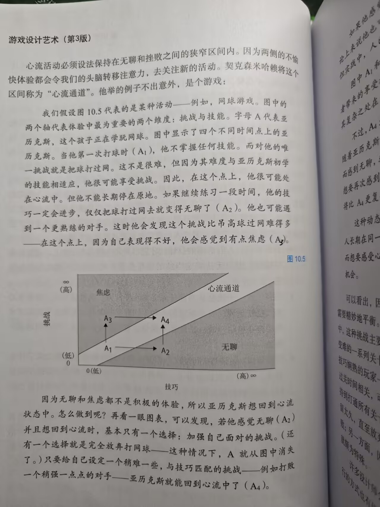
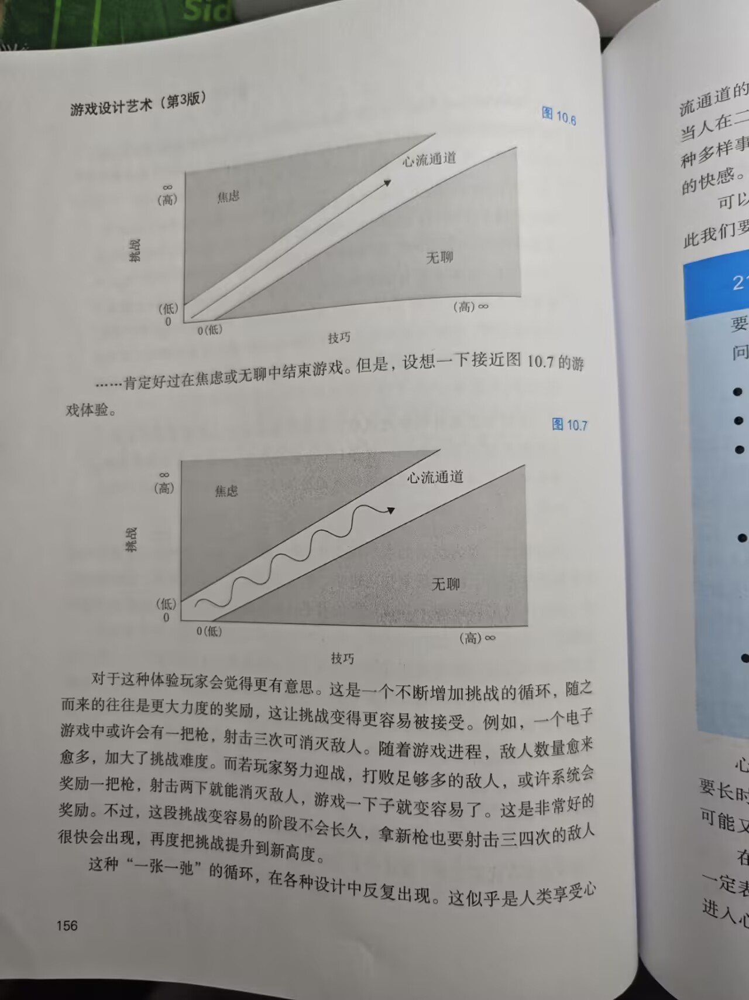

# 第十章 体验源自玩家的大脑

# 四项潜意识

​	有四项基本心理能力让玩游戏变成可能。他们是：**建模、集中、想象、共情。**我们会轮流思考每一项，并且考察玩家潜意识中秘密的优先事项。

## 建模

​	现实是很复杂的。我们的大脑能勉强应对复杂现实的唯一方法就是把现实简化，只有这样才能里出一些头绪。有鉴于此，我们的大脑并不直接处理现实，而是处理其简化版的模型。

​	大脑每天要做巨量工作来讲复杂的现实浓缩简化成精神模型，使其变得容易记忆、思考和处理。而且，不仅仅视觉如此，人际关系、评估风险和收益、进行决策，都要如此。我们的大脑看见复杂情景，便会尝试将其浓缩为一套简单的规则与关系，让思维可以驾驭。

​	我们生为设计师，一定要对这些大脑模型多家关心。**因为每个游戏都有一套简单规则，是预先简化过的模型**，让人能轻松消化和处理。玩游戏能放松身心，就是因为游戏剥离了许多复杂事务，大脑不必做现实中的那么多工作了。九宫格或者双陆棋这种抽象的策略游戏，几乎简化到只剩下模型。其他一些游戏，例如电脑上的角色扮演游戏，则是取一些简单模型，包上美学的糖衣来吸引人。这么一包装，努力消化模型的过程也变得愉快了。这与现实世界真是云泥之别。**在现实中，就连搞清楚游戏规则是说明都要煞费苦心，像按照规则完好更是殚精竭虑，还得时刻怀疑自己做的究竟对不对。正因如此，游戏可以帮助人演练现实。**

## 专注（心流）

> 时光有时像鸟儿飞逝，有时像蜗牛爬行；但注意不到时间究竟是快是慢的时候，才是人最幸福的时候。
>
> ​                                                                                                                                                                              ——伊万·屠格涅夫

​	我们的大脑理解世界，有一项关键技巧，那就是选择性地集中注意力——忽略一些事物，对另一些事物投入更多的精神能量。比如当一屋子人同时开口说话时，我们能集中注意力听某段对话，而不受到太多干扰。

​	在任意一个时刻，我们专注的内容都是由潜意识的欲望和清醒的一直共同决定的。创作游戏时，我们的目的是创造有趣的体验，足以令玩家尽可能长久而强烈地集中注意力。当一件事情长期吸引我们全部注意力和想象力时，人就进入了一种有趣的精神状态：周围的世界似乎疏远了，心中没有任何杂念。我们一心扑在眼前的事情上，完全不知道时间过了多久。这种持续专注、快乐、享受的状态被称为**“心流”**，是米哈里·契克森米哈赖等心理学家升入研究的课题。有人将心流定义为“完全专注于一个活动，并感到高度的乐趣和满足感”。仔细研究心流对游戏设计师很有用，因为这正是我们希望玩家们在游戏中享受的状态。想要活动中令玩家进入心流状态，要达成以下关键点。

- **目标清晰**：人有清晰的目标，才更容易集中精力在任务上。而目标不明确时，因为无法确定当前的动作是否有效，也就不那么沉浸在任务上。
- **没有干扰**：干扰会从当前任务上偷走专注力，而没有专注，就没有心流。也就是说，要令玩家的心和手同时参加游戏。无需思考的低技术劳动会令思绪漫游；枯坐思考则会让双手不安。这些“疼痒的感觉”都是一种干扰
- **反馈直接**：如果每次行动之后都要等待一段时间才能知道造成了说明效果，我们很快就会分心，不在专注于手中的任务了。如果反馈及时，我们就很容易保持专注。在第15章我们会进一步谈到有关反馈的话题。
- **持续挑战：**人类喜爱挑战，但一定要是感觉可以完成的挑战。如果我们觉得完成不了，就会感到挫败，进而开始寻找可能带来奖赏的活动。另一方面，如果挑战太简单，我们则感觉无聊，头脑也会开始寻找可能带来奖赏的活动。在第13章我们会谈到更多有关挑战的内容。

​	心流活动必须设法保持在无聊和挫败之间的狭窄区间内。因为两侧的不愉快体验都会令我们的头脑转移注意力，去关注新的活动。契克森米哈赖把这个区间称为**“心流通道”**。他举的例子如下：

​	

​	可以看出，因为玩家的水平很少长期停在原地，将玩家留在心流通道内就需要精妙地平衡。随着玩家技巧进步，你也必须拿出相应的挑战。在传统游戏中，这种挑战主要来源于寻找更强的对手。而在电子游戏中,一般都使用逐步变难的一系列关卡。这种多关卡、逐步变难的模式能很好地达到平衡境界——技巧娴熟的玩一般都能快速通过低级关卡，直达能感到挑战的关卡。技巧与过关时间相关，可令熟练的玩家不至于无聊。但到最后，只有少数玩家才能坚持到打通所有关卡，赢得胜利。大部分玩家都会在某一关中进人挫败区域，停留太久，直至放弃。这究竞是好是坏，还没有定论:一方面，许多玩家感到挫败;另一方面，因为只有技巧熟练又内心坚韧的玩家才能打到最后，通关的成就颇为特殊。

​	对于这种体验玩家会觉得更有意思。这是一个不断增加挑战的循环，随之而来的往往是更大力度的奖励，这让挑战变得更容易被接受。例如，一个电子游戏中或许会有一把枪，射击三次可消灭敌人。随着游戏进程，敌人数量愈来愈多，加大了挑战难度。而若玩家努力迎战，打败足够多的敌人，或许系统会奖励一把枪，射击两下就能消灭敌人，游戏一下子就变容易了。这是非常好的奖励。不过，这段挑战变容易的阶段不会长久，拿新枪也要射击三四次的敌人很快会出现，再度把挑战提升到新高度。

​	这种 “一张一弛” 的循环，在各种设计中反复出现。这似乎是人类享受心流通道的一种固有模式。太过紧张，人就筋疲力尽；太过放松，人就渐觉无聊。当人在二者之间起落，便既享受激动，也享受放松。同时，这种波动既带来各种多样事件 ——“意料之外” 的快感，也带来反馈符合预期 ——“意料之中”的快感。

​	可以看到，心流和心流通道的概念对于游戏体验的讨论分析颇有用处，因此我们要将它列为 21 号透镜。

## 21号透镜：心流

​	要使用这一透镜，请考虑是说明在吸引玩家的注意力。

​	问自己这些问题：

- 我的游戏有清晰的目标吗？如果没有，怎样改好？
- 玩家的目标和我的初衷一致吗？
- 游戏中是否有令玩家分心，以致忘记目标的部分？若有，能否减少这些干扰，或将之整合进游戏目标内？
- 我的游戏是否提供了一连串不太容易，也不太难的挑战？有没有考虑到玩家的技巧可能逐步提高？
- 玩家的技巧提高的速度和我的期望相符吗？若不是，应该怎样改进？

------

​	心流状态很难测试出来。在短短十分钟的游戏过程中是看不到它的，必须要长时间观察玩家才行。而且，头几次能让人保持在心流中的游戏，多玩几次可能又会让人无聊或挫败，这就更加棘手了。

​	在观察玩家的时候，很容易错过心流，所以你必须学会识别它。心流并不一定表现为外在的情感反应，反而经常表现为安静地独处。玩单人游戏的玩家进入心流状态后，一般都会安静下来，不时轻声自言自语。因为太过专注，你提问的时候，他们有时会反应很慢，有时还会烦躁起来。而玩多人游戏的玩家进入心流状态后，时常极为热情地互相交流，并一直专注在游戏者。一旦发现你的游戏中有玩家进入心流，可要看仔细了——他们是不会永远在心流中的。务必要注意关键的时刻，——会有一个事件发生，玩家就离开心流通道了。然后，你才能确保下一关版本的游戏圆形把这个事件剔除出去。

## 共情

​	身为人类，我们有一种惊人的能力，可将自己投射到他人的立场上去。当我们运用这种能力，就会尽全力想他人之所想，感受他人的感受。我们能做到这样，是我们理解他人能力的一个特征，也是游戏过程不可分割的一部分。

​	我们游戏设计师，要与小说家、画家、电影制作人一样运用共情。但除此之外，我们还有一套新的交互共情方式。游戏就是解决问题的过程，而情感投射是解决问题的好方法。如果我能站在别人的立场思考，就能更好地回答 “那个人能怎么解决某个特定问题”。而且，在游戏里，你投射到人物身上的不仅仅有情感，还有整个做决策的能力。其他不能互动的媒体形式就做不到这一点。其实现的方法会在第 20 章中讲到。

## 想象

> 最美的世界，只能通过想象进入。 ——海伦凯勒

​	通过想象力，游戏被带入玩家大脑中，因此玩家也被带入游戏世界。

​	现在谈到想象的力量，你大概以为是说创造梦境般奇幻世界的能力，但我要讲的其实平常许多。我所说的想象力，是一种人人拥有却习以为常，但超能力 —— 每一个人在日常交流和解决问题时，都要进行的日常想象。比如说，你说个小故事，“邮递员昨天偷了我的车。” 我其实只透露了一点信息，但你脑子里已经画出一幅图了。奇怪的是，这幅图里有各种细节，故事里都没提到。看一看你大脑中形成的图像，回答这些问题：

- 邮递员长什么样子？
- 车被偷的时候，停在什么样的街区里？
- 车是什么颜色的？
- 他偷车时是什么时间？
- 他用什么方法偷的车？
- 他为什么要偷车？

​	你看，这些事情我一件也没有告诉你，但你超凡的想象已已经造出了一大堆细节，帮助你更轻松地思考这个故事。若我突然给你更多信息，例如 “那不是真车，而是一辆很贵的模型玩具车。” 你马上会重组一幅想象的图来适应听到的内容，以上问题的答案也会相应变化。这种自动填补空隙的能力与游戏设计关系很紧密。它说明我们在游戏中不必给出所有细节，玩家自会将其补完。而了解应该给玩家展示什么，又应将什么留待想象，就是技艺的体现了。

​	想象力有两个重要功能：第一是交流（一般用于讲故事）；第二是解决问题。由于游戏突出了这两方面的特点，游戏设计师必须了解如何怎样让玩家的想象力成为说故事的助力，还要了解想象力能解决、不能解决的问题。

​	人脑确实是我们所知之中，最引人入胜、不可思议、复杂微妙的东西。或许我们永远不能揭开它所有的谜题。但我们了解它越多，便越有机会在其中创造绝佳体验，因为一切游戏体验都发生在那里。最后别忘了，你自己也装备着一颗大脑。你可以自己运用建模、专注、共情和想象能力，来了解这些能力是如何在你的玩家脑中运用的。这样一来，倾听自己就成了倾听受众的关键。下一章，我们就要倾听一下自己，了解大脑使用这些能力的动机来自哪里。
